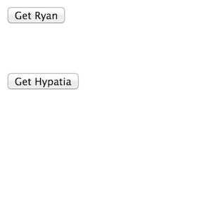
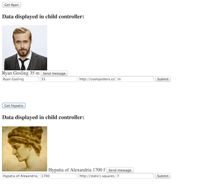
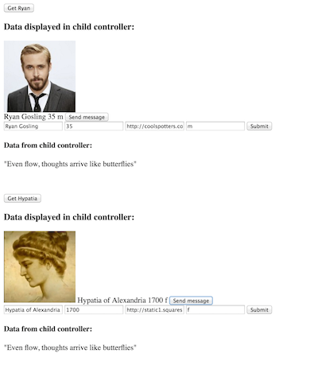

# ADVANCED ANGULAR POTPOURRI

### exercises on various Angular techniques 


### Starter Code
You will receive a simple backend with an `index` route that serves Ryan Gosling and Hypatia of Alexandria (from our Wednesday dating app). **Seed** your database by going to `/users/seed`, and verifying the JSON in the index route, `/users`.

For later, there is also a `PUT` route in the `usersController` within the server.

**NOTE** This app doesn't **do** much, but serves as a platform for you to practise various Angular helpers and techniques:
######various
- `$http`
- `$scope.$broadcast`
- `$scope.$emit`
- `$scope.$on`
- `ng-include` (templating)
- custom directives (templating)
	- `$scope.$parent`


##1. $scope.$broadcast, $scope.$on

`index.html`  
You have two controllers separate from each other, `RyanController` and `HypatiaController`. Each of them contains the same child controller `InfoController`. The child controller will display the information associated with both Ryan and Hypatia.

The format looks like this:

```
* Ryan
*	-child
*		-display data
*	-end child
* end Ryan


* Hypatia
*	-child
*		- display data
*	-end child
* end Hypatia
```

Make it so that when you click the `getInfo()` button in either controller, the data is retrieved from the database and then shown on the page from within the child. The data must be `broadcast` to the child, and `on` receipt the child should displays that data. 

**NOTE**, Ryan should be results.data[0] and Hypatia should be results.data[1], but double check.


##2. $scope.$emit, $scope.$on

Next, put a button inside the child that runs a function in the child controller. The function should `emit` a message back up to the parent, and `on` receipt display inside the parent (not in the child).

**ng-if** : use `ng-if` to hide the button until the child has information.

##3. ng-include

Use `ng-include` to load a template that displays the data inside the child, so that you don't have to write all the curlies each time within each child.

Hint on broadcasting multiple values: You can broadcast an array of separate values.


##4. Custom Directives and $scope.$parent

This is really difficult, so please have a nutritious smoothie before you begin. Deep breaths.

- Make a custom directive that renders a form. **In `index.html`, put the directive inside each of the child controllers**. In `app.js` your directive should have `restrict:`, `templateUrl:`, `controller:`, and `controllerAs:`.

- The form should be a template in a `form.html` file that the directive's `templateUrl:` uses.

- The form should `edit` the information from the `InfoController`, so it should be pre-populated with the user's name, gender, etc, from the `InfoController`. 

- Upon submit, the form should send a `PUT` request to the server. The route already exists in the server, in `usersController`, you just have to get data to it (and sent back for verification).

- In the controller of the custom directive, you will need to be able to access the ng-model from its parent. For this, you can use `$scope.$parent.whateverthemodelis`

**This process is really difficult, just making an attempt at it is great**


#### NOTES ON CUSTOM DIRECTIVE SYNTAX

You don't have to put the controller constructor inside the directive like this:

```
app.directive('myDirective', function() {
	controller: the entire controller written
	              out here inside the directive
	              lots of code
	              doing things
	            end of controller constructor
});
```

You can decouple the directive and its controller like this:

```
app.controller('formController', [function() {
	the controller written
	here like we do with other controllers
	doing things
]);

app.directive('myDirective', function() {
	controller: 'formController'
});
```


</br>

More information on custom directives: http://weblogs.asp.net/dwahlin/creating-custom-angularjs-directives-part-i-the-fundamentals


### Images

*Landing page shows:*



*When getInfo buttons are pressed:*



*When send message buttons are pressed:*




## BIG BONUSES

- #### ADVANCED CUSTOM DIRECTIVES:

Have a look at this tutorial for making a directive for creating draggable DOM elements to get an idea of fancy stuff that directives can do: https://blog.parkji.co.uk/2013/08/11/native-drag-and-drop-in-angularjs.html


- #### PASSPORT

If you get this far, you should look into using authentication in a single-page app. You will need to serve up an .ejs file as your landing page / single-page.


...

