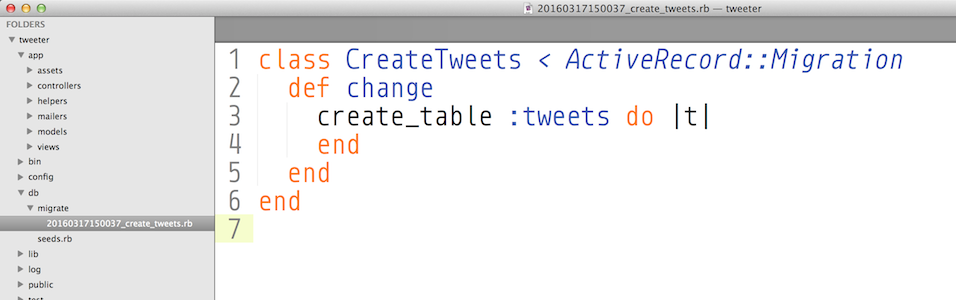
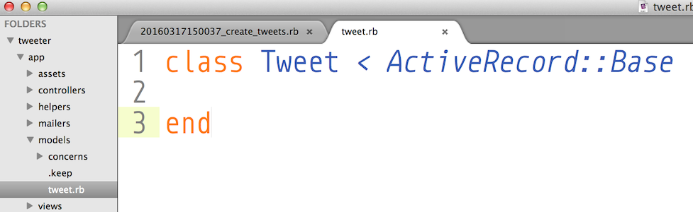

# TWEET_R


## Yep.
<br/>
<br/>

## Walkthrough: Rails R app - R stands for Read (the 'R' in CRUD)


We will be making a new Rails R app with a single model called `tweet`, with routes, controllers, and views. 

This app will use a database, `postgresql`. You will be doing migrations and filling out a schema. Don't worry about what the word 'migration' means in this context, or what it does. Just follow the instructions and all should become clear.

We will be making much of this manually without scaffolds or generators for our controllers and models. This way, you will develop some muscle memory and a greater understanding of each step of the process. Having said that, this app goes over only the most basic stuff that you need to know to display an index and show route, and nothing more. Once you have these fundamentals under your belt we can implement more advanced stuff later on.

Rails is a framework that favors **convention** over **configuration**, so it is important to name your folders, files, and classes with the correct combination of upper/lowercase letters and plural/singular business.


### 1. LET THERE BE LIGHT
1. Make a new Rails app called `tweeter`. Set `postgresql` as the database. Here is the command:  
`rails new tweeter --database=postgresql`

2. **Go into your new directory**

### 2. DATABASE AND MIGRATIONS

#####Let's walk through how to set up your database. This involves:
```   
	1. Creating the database    
	2. Setting up a migration   
	3. Filling in a schema  
	4. Running the migration
```  

- Create your database in your project directory by running this command:
`rake db:create`

```
Rake is a helpful task manager in Rails that can do lots of things for us, including creating, migrating and seeding our database.
```

- Test that the db has been created by typing `rails dbconsole`. This opens a console for our database, in which we can type raw SQL commands. For now, just check that it opens, then quit the console with `\q`.


``` 
CONGRATULATIONS. You have successfully set up a database for Rails. 
```


#####Now it's time for Migrations

A migration is a proposed change to the database. You set up a migration, enter your changes, then run the migration to lock in the changes. Rails then keeps a record of all migrations so that you can see the full history of your database.

- **Make a new migration**    
Let's set up a migration. In terminal, inside your project folder, type: `rails g migration CreateTweets`.  The `g` is short for generate. `Create` is a Rails keyword helper for making migration files for your database. `Tweets` must be *plural* and have a *capital T*. There is no space between Create and Tweets. It's `CreateTweets`.

- In your text editor project folder, look in the `db` folder. The migration command created another folder `migrate`, and you should see a migration file in there that looks like a bunch of numbers:


Click on the migration file, and you should see some code like this:




In here, you will add your model's columns and datatypes, as if making  a `schema`.

A tweet should have an author, a title, content, and timestamps. Don't worry about why the syntax is the way it is, for now, just adapt your migration file to look like this:

```
class CreateTweets < ActiveRecord::Migration
  def change
    create_table :tweets do |t|
	    t.string   "title"
	    t.text     "content"
	    t.string   "author"
    end
  end
end
```


- Now, run the migration. In terminal, in your project folder as usual,
enter `rake db:migrate`. We're using rake again to help us with our database. In this case, it's running our migrations. Thanks, rake.

What does the migration do? It adds the schema to our database, and also makes us a `schema.rb` file in the db folder. We never touch the schema.rb file.

**IMPORTANT: Once a migration has run, you never edit your migration or schema file. The migration files are there forever as records of all your migrations. To edit a migration, you make a new migration to act on the previous one. To alter your schema, you also make a new migration.**


- Test that your db has been schema-fied by going into the console and typing `rails dbconsole`. Perform a `SELECT * FROM tweets` to test that your db has the correct columns, then quit the dbconsole with `\q`.


```
CONGRATULATIONS. You have successfully created and run a migration.
```


### 3. MODELS

This is "relatively straightforward". :P

1. **Create a model.** In the app/models folder, NOT in concerns, create a file called `tweet.rb`. It has to be **singular lower case** or it will break. 

2. Inside `tweet.rb` make a class called Tweet **singular, uppcase T** that inherits from ActiveRecord::Base.

```
class Tweet < ActiveRecord::Base

end
```





That's it!


### 4. SEED
- Seed your database with data for your models: two Tweet entries. In the `db` folder there is a file called `seeds.rb` wherein you can make seeds like the following:

```
Tweet.create({
  title: "Just found this", 
  content: "the square of the hypotenuse is equal to the sum of the squares of the other two sides",
  author: "Pythagoras570"
})

Tweet.create({
  title: "I'm walkin' here", 
  content: "Hey, I'm walkin' here!",
  author: "Nicky62"
})
```


- To import your seed into your database, run `rake db:seed` in terminal.

- Test that your seed worked by going into `rails dbconsole`, performing a SELECT query, and then quit.

- Test your model by opening up Rails console. Rails console is where you can make Active Record queries. Open it with `rails console` or just `rails c`. Query all of your tweets with `Tweet.all`. Quit rails console with `exit`.


### 4. ROUTES
1. In config/routes.rb add `resources :tweets`.  
Test your routes by typing `rake routes` in the console. You should get this:

```
      Prefix Verb   URI Pattern               Controller#Action
     tweets GET    /tweets(.:format)          tweets#index
           POST   /tweets(.:format)          tweets#create
  new_tweet GET    /tweets/new(.:format)      tweets#new
 edit_tweet GET    /tweets/:id/edit(.:format) tweets#edit
      tweet GET    /tweets/:id(.:format)      tweets#show
           PATCH  /tweets/:id(.:format)      tweets#update
           PUT    /tweets/:id(.:format)      tweets#update
           DELETE /tweets/:id(.:format)      tweets#destroy
```

You can delete all the extraneous comments in `routes.rb`

  
### 5. CONTROLLER
1. In your app/controllers folder, manually create a new file
called `tweets_controller.rb`. Don't put it into the concerns folder. **The word tweets must be lowercase and plural or the app will break.**

2. Inside `tweets_controller.rb` make a new class called `TweetsController` that inherits from `ApplicationController`. **The word Tweets here must be plural with an uppercase T, and Controller must have an uppercase C**

3. Add the methods that correspond to your restful routes you'll be using: index and show.


*** Try running your app to see if it will break with `rails s`. The `s` is short for server. It won't show anything yet, but you should get it to where it won't break.***


### 6. VIEWS

1. In the app/views folder, make a folder for your tweets views. It should be called tweets **lowercase plural**.

2. In your views/tweets folder, start by making a view file called `index.html.erb`. This corresponds to your index method in your controller.


### 7. TEST

1. Make an instance variable in your tweets#index controller method. Set it to a string, such as `@test = "gidday mate"`. **Instance variable are accessible in the views**. Regular variables are not.

2. In your tweets view folder, in `index.html.erb`, write some erb that will display the instance variable: `<%=@test%>` 
  
3. When you go to access the url `/tweets` in your browser (the tweets index), you should see the value of `@test` on your screen.
  
  
### 8. MVC


###### INDEX
The index route in your controller is a GET route and wants to send information to the page for a user to see. For the index route, in your controller file:

```
  def index
    @tweets = Tweet.all
  end
```

`Tweet.all` queries your model for every tweet entry and sends back an array. We save this array into `@tweets`.  

In our `index.html.erb` view, we can iterate over the `@tweets` array using Ruby, Let's use `.each` to display every individual tweet.

``` 
<% @tweets.each do |single_tweet| %>
    <%= single_tweet.title %>
    <%= single_tweet.author %>
    <%= single_tweet.content %>
<% end %>
```
  
**Test this out and keep working at it until you get each tweet displayed**  

You can go ahead and make this legible on the page using html tags.
  


###### SHOW 

```
  def show
    @tweet = Tweet.find(params[:id])
  end
```

### 9. ON YOUR OWN

1. Make a view for your show.

2. Make each tweet on your index page link to its corresponding show page.

3. Add a new Tweet with Active Record through rails console, `rails c`. See it appear in the view.
 
4. Edit a Tweet with Active Record through rails console. See that it changed in the view.

5. Delete a tweet with Active Record through rails console. See that it was deleted in the view.

