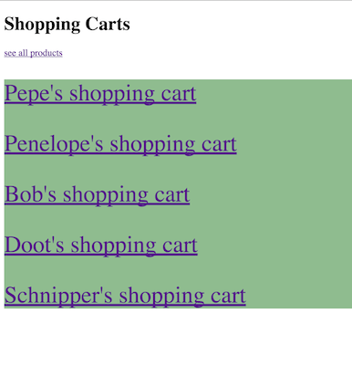
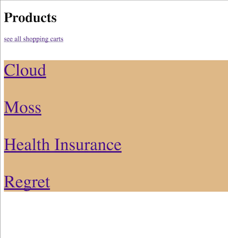
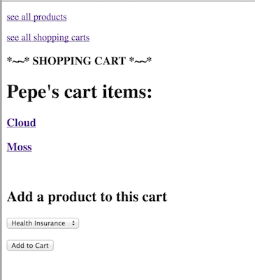

# Rails - PERSONAL SHOPPER


#### Rails many-to-many and (bonus) one-to-many practise

## APP

You are a personal shopper for a variety of clients. These people are incapable of shopping for whatever reason--perhaps they have `bone-itis`. Shopping carts and products have a **many-to-many** relationship. They are interrelated in the app by adding each to each. For example: On a shopping cart page, you can add many products to a shopping cart. On a product page, you can add many shopping carts to the product. They are mirror images of each other.

##### app pages
- an index of shopping carts (one for each client)
- an index of products
- a show page for each shopping cart, on which you can add products to the cart
- a show page for each product, on which you can add the product to some carts
	
##### bonus  
- product reviews on the product's show page (one-to-many)

The purpose of tonight's homework is not to make a full CRUD app, but to display and test relations between tables, especially the two-way nature of a `many-to-many` relationship. Some of this will be tutorial-style, the rest left for you to figure out.
</br>
</br>

**Example shopping carts index** (no styling yet)


</br></br>

**Example products index** (no styling yet)


</br></br>


**Example shopping cart show** (no styling yet)  
There is a dropdown menu to add products to this cart.


</br></br>


**Example product show** (no styling yet)  
There is a dropwdown menu to add carts to this product.


</br></br>


## START

`rails new shopping_carts_app --database=postgresql`

**Go into your new rails app directory**

`rake db:create`

Test that you have made a postgresql database (not sqlite) by typing `rails dbconsole` then quitting.

## GENERATORS

This time we will use generators for our models and controllers. We have two models and controllers: **shopping carts** and **products**. Go ahead and generate all of the following:

####Shopping carts

```rails g model ShoppingCart```

This will give you a **migration file**, and a model file **shopping_cart.rb**


```rails g controller shopping_carts```

This will give you a controller file **shopping_carts_controller.rb** and a folder for your shopping_carts views.


Notice that our model is uppercase-camelcase `ShoppingCart` singular-- the associated controller command will therefore need to be lowercase-snakecase plural `shopping_carts`.
  
Remember, the model generator adds a migration file so you **don't need to generate a migration.** 

Do the same for Products and Reviews.

####Products

```rails g model Product```

```rails g controller products```


#### Tables
We will have THREE tables that we will make soon:  
1. shopping_carts  
2. products  
3. products_shopping_carts (a join table)  


## MODELS

#### 1. SHOPPING CARTS
Shopping carts have a **many-to-many** relationship with products. A shopping cart can have many products, and a product can belong to many shopping carts. Later we will build a join table for shopping carts and products. In your ShoppingCart model file, the relationship is specified like this: `has_and_belongs_to_many :products`

#### 2. PRODUCTS
Products have a **many-to-many** relationship with shopping carts. A product can have many shopping carts, and a shopping cart can belong to many products. Later we will build a join table for products and shopping carts. In your Product model file the relationship is specified like this: `has_and_belongs_to_many :shopping_carts`. 


## MIGRATION FILES

```
Since shopping_carts and products have a *many-to-many** relationship, neither of them needs a foreign key to reference the other.
```

shopping_carts     
1. client_name - string  

products  
1. name - string  
2. price - decimal  
3. manufacturer - string  
4. img_url - text    


### JOIN TABLE
While our model generators have conveniently created our migration files, now we must generate our own migration file for the join table.

`rails g migration CreateJoinTable shopping_carts products`

In the migration file, delete the t.index entries within createTable and replace them with

```       
      t.integer :shopping_cart_id
      t.integer :product_id
```

Double check all your migration files and run your migrations. `rake db:migrate`


## SEEDING

In your `seeds.rb`, create a bunch of shopping carts and products. Distribute the products between shopping carts of your choosing, but make sure there are carts that do not have all the products. (See below). Also, feel free to use the seed below.

For convenience, you can create **multiple entries** for a single model ---

This makes an array called `items` that will contain multiple Products to seed. Each product will be conveniently seeded from that array when you run rake db:seed. 

```
items = Product.create([
    {   
    	name: 'Cloud',
        price: 20.45,
        manufacturer: 'Pufft Corp',
        img_url: 'image here'
    },{
        name: 'Moss',
        price: 2.90,
        manufacturer: 'Gardeny Glades',
        img_url: 'image here'
    },{
    	name: 'Health Insurance',
    	price: 9999999999,
    	manufacturer: 'Kill U Corp',
    	img_url: 'image here'
    },{
        name: 'Regret',
    	price: 0,
    	manufacturer: 'Yourself',
    	img_url: 'image here'
    }
])
```

`For now, items[0] has the name 'Cloud'. Remember for later.`

This creates an array called carts, and each cart will be conveniently seeded from this array when you run rake db:seed. 

```
carts = ShoppingCart.create([
    { client_name: 'Pepe' },
    { client_name: 'Penelope' },
    { client_name: 'Bob' },
    { client_name: 'Doot'},
    { client_name: 'Schnipper'}
])
```

`For now, carts[1] has the username 'Penelope'. Remember for later.`

Finally, to seed items in a **many-to-many** relationship, you can push items into the array associated through the join table. This push goes after the products array and items array have been established. Pushing into a many-to-many array with seed arrays:

```
carts[0].products.push(items[0], items[1])
carts[1].products.push(items[1])
```

#### side-note
If you create your seeds independently without using arrays, assuming you used cart, item1, item2 as variable names for those seeds ---

Pushing into a many-to-many array would work like this:

```
cart.products.push(item1, item2)
```

#### rake db:seed
Seed your database: `rake db:seed`

If you **really mess up**, you can `rake db:reset`, and this will empty your database and re-run the seed.

Check the database has been seeded properly in `rails dbconsole`:

`SELECT * FROM shopping_carts;`  
`SELECT * FROM products;`  
`SELECT * FROM products_shopping_carts;`
</br>
</br>
</br>

# STAGE ONE
#### ROUTES

- For now, add resources for `shopping carts` and `products`  
- Set your `root to: 'shopping_carts#index'`


#### CONTROLLERS

- **Shopping carts**  
  - We will need an `index` and `show`.

- **Products**  
  - We will need an `index` and a `show`.

#### VIEWS

#####SHOPPING CARTS

We will want an **index page** to see all our shopping carts. Provide a link to the products index page.

This shopping carts **index page** will have a list of carts with the client_names, for example:

```
Pepe's shopping cart
Penelope's shopping cart
```

Each will be a link to the show page of that client's particular cart.

The **show page** of each cart will list all the products it contains.
Hint: `<% @cart.products.each do |item| %>`

Each product name will be a link to that particular product's own show page.

Note: remember to give the user the ability to navigate back to the shopping cart index page from each cart's show page.


#####PRODUCTS

We will want an **index page** so that we can browse the products. Each product will link to its own **show page**.

Also, on the products **index page**, provide a link to the shopping cart index page.

On the product's **show page** add all the product details. List all the clients who have that product in a cart with a link to the client's shopping cart.

</br>

# STAGE 2 - ADD SHOPPING CART TO PRODUCT
From a product's **show** page, we want to be able to conveniently put that product in one of our client's shopping carts.

#####PRODUCTS

On the products **show page**, give the user the ability to add that product to one of the client's carts using a dropdown menu to select which cart.

The process is as follows:

Make a **custom action** in your products controller. This action will push an incoming cart into the array of carts associated with the chosen product. Don't copy and paste:

```
  def add_cart
    product = Product.find(params[:id])
    cart = ShoppingCart.find(params[:cart_id])
    product.shopping_carts << cart
    redirect_to product_path(product)
  end
 ```

**Before** you add this to your products controller, look at each line and write down what you expect each line will do.

Now we have a custom action, but Rails doesn't know how to route to it. To do this, in `config/routes.rb` we can add a new member to our product's routes:

```
  resources :products do
    member do
      put 'add_cart'
    end
  end
```

So, instead of just resources :products, we have a new member and we have specified that it is a PUT route. Type `rake routes` to see that your routes now contain a path to your new method.


Back to your **show page** for your product, you will want a form that will allow you to choose a cart to place the item into. You will need to give all of the carts to the show page: in the products `show` action: `@carts = ShoppingCart.all`


We will do this without a form helper for now. Do not copy and paste:

```
  <form action="/products/<%= @product.id %>/add_cart" method="post">
    <input type="hidden" name="_method" value="put">
    <select name="cart_id">
      <% @carts.each do |cart| %>
      	<% unless @product.shopping_carts.include?(cart) %>
        <option value="<%= cart.id %>"><%= cart.client_name %></option>
        <% end %>
      <% end %>
    </select><br><br>
    <input type="submit" value="Add to Cart">
  </form>
 ```

 Go over each line and write down what you expect it does. When you have coded it into your view,
 run the server and go to the page, and Inspect Element. This is what your form looks like in HTML.

 Your form will not work yet. There is one more piece. Because we built a form without form helpers, Rails might not like our authenticity tokens. To bypass the authenticity tokens, put

 ``` skip_before_action :verify_authenticity_token ``` 

before your actions in the products controller.


# STAGE 3 - ADD PRODUCT TO SHOPPING CART

From a cart's **show** page, we want to be able to conveniently add a product to that cart.

This will be a mirror image of stage 2. Same thing, different direction.

#####SHOPPING CARTS

On the shopping carts **show page**, give the user the ability to add a product to the cart using a dropdown menu to select which product.

The process is as follows:

Make a **custom action** in your shopping carts controller. This action will push an incoming product into the array of products associated with the current cart. Don't copy and paste:

```
  def add_product
    cart = ShoppingCart.find(params[:id])
    product = Product.find(params[:product_id])
    cart.products << product
    redirect_to shopping_cart_path(cart)
  end
 ```

**Before** you add this to your shopping carts controller, look at each line and write down what you expect each line will do.

Now we have a custom action, but Rails doesn't know how to route to it. To do this, in `config/routes.rb` we can add a new member to our shopping cart's routes:

```
  resources :shopping_carts do
    member do
      put 'add_product'
    end
  end
```

So, instead of just resources :shopping_carts, we have a new member and we have specified that it is a PUT route. Type `rake routes` to see that your routes now contain a path to your new method.


Back to your **show page** for your cart, you will want a form that will allow you to choose a product to place into the cart. You will need to give all of the products to the show page: in the shopping carts `show` action: `@products = Product.all`


We will do this without a form helper for now. Do not copy and paste:

```
  <form action="/shopping_carts/<%= @cart.id %>/add_product" method="post">
    <input type="hidden" name="_method" value="put">
    <select name="product_id">
      <% @products.each do |product| %>
      	<% unless @cart.products.include?(product) %>
        <option value="<%= product.id %>"><%= product.name %></option>
        <% end %>
      <% end %>
    </select><br><br>
    <input type="submit" value="Add to Cart">
  </form>
 ```

 Go over each line and write down what you expect it does. When you have coded it into your view,
 run the server and go to the page, and Inspect Element. This is what your form looks like in HTML.

 Your form will not work yet. There is one more piece. Because we built a form without form helpers, Rails might not like our authenticity tokens. To bypass the authenticity tokens, put

 ``` skip_before_action :verify_authenticity_token ``` 

before your actions in the shopping carts controller.


#### CONGRATULATIONS! You just added two-way functionality for a many-to-many relationship

</br>

## BONUS ONE - REVIEWS
On the **show page** of a product, display all the reviews for that product.

```rails g model Review```

```rails g controller reviews```

Reviews belong_to a product. `belongs_to :products`.

reviews migration file - **remember to add the foreign key** 

1. author - string  
2. content - text  
3. `t.belongs_to :product` <-- foreign key

Seed:

```
Review.create({
		author: 'Dale',
		content: 'I think it is ok',
		product_id: 1
})
```


## BONUS TWO, CRUD STUFF 

--
*If you have gotten this far, it's time to Work It On Out* : Include a form for submitting a new review on the product **show page**. You should be able to successfully add reviews to products.

##### SHOPPING CARTS  
Allow the user to `create` a new (empty) shopping cart.
Allow the user to `delete` a shopping cart with a delete link next to the cart's name. Remember to redirect.

On the shopping cart **show page** allow the user to `remove` a product from the cart.

## BONUS THREE

2. Add more products, carts, and reviews using either the rails console, or the dbconsole. 
3. Show the number of products in a cart on the shopping cart index page.
4. Generate and run a new migration that adds a column to your products table (the column could be called `weight` and accepts an integer, for example).
5. Give the option to edit and delete a review, and have it work.


