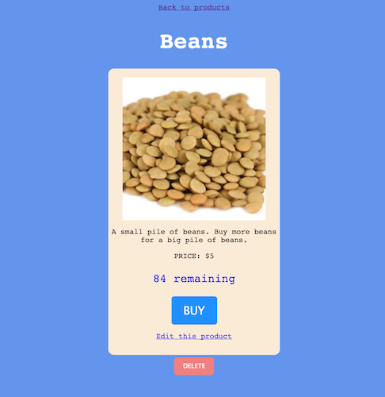

# MONGOOSE STORE

Make a product inventory manager with full CRUD using Mongoose.


## APP

###Index page
Your app should have an index page where
 
- all the products are displayed
- the images link to the product's **show** page
- and there should be a link to add a new product.


###Show page
Your show page should display a product with 

- a link back to the products
- a link to edit the product (goes to the edit page)
- a delete button that deletes
- and the number of items remaining in stock.

For the **Primary Bonus**: There will be a BUY button. The BUY button will reduce the number of items in stock by 1 each time it's pressed.




If the quantity of your item is zero, the show page should say 'OUT OF STOCK' instead of saying how many are remaining. (Hint: `ejs`). On the edit page, make sure you can set the quantity to zero if you want so that you can test if this is working.

For the **Primary Bonus** the BUY button should also not be rendered.


###Edit page and New page
These views should render forms and submit to the appropriate routes.

###Redirects:
- The *create* route should redirect to the index
- The *delete* route should redirect to the index
- The *update* route will redirect back to the product's **show** page.

- For the **Primary Bonus** the BUY button will go to a route that redirects back to the product's **show** page
	


### Directions

- Set up Express with MVC architecture

- You will need the seven RESTful routes to start. Test that they are accessible with Postman or cURL. Don't worry about what the BUY button does or where it goes just yet. Just set up your regular RESTful stuff.

- You will need to make a Mongoose Schema in a `products.js` file for your products. The schema should have:

```
  	name: String,
	description: String,
	img: String,
	price: Number,
	qty: Number
```
- Make sure you connect to your Mongo server

```
mongoose.connect('mongodb://localhost/mongoose_store');

// this works for me, but if you have some other config, check the class notes
```

- **If you have mongoose.connect in your file, Your Node server will crash if you aren't running `mongod`**


- Make sure your controller can access your model
```
var Product = require('../models/products');
```

For testing purposes, especially for having quick access to those wacky Mongo ids, maybe think about having a route `/json` that `res.sends` an index of all the data in json format so that you can copy/paste ids into your url bar or cURL or what-have-you.


###SEED
You can use these seeds to get starting data if you so choose. Handy hint:  Make a route in your products controller `/seed/newproducts`, and to seed your database, just visit the route **once** in your browser.

```
router.get('/seed/newproducts', function(req, res) {

	var newProducts = [
		{
			name: "Beans",
			description: "A small pile of beans. Buy more beans for a big pile of beans.",
	        img: "http://www.allbulkfoods.com/images/catalog/419240.jpg",
			price: 5,
			qty: 99
		}, {
			name: "Bones",
			description: "It's just a bag of bones.",
    	    img: "http://bluelips.com/prod_images_large/bones1.jpg",
			price: 25,
			qty: 0
	  }, {
			name: "Bins",
			description: "A stack of colorful bins for your beans and bones.",
    	    img: "http://www.clipartbest.com/cliparts/9cz/rMM/9czrMMBcE.jpeg",
			price: 7000,
			qty: 1
	  }
	];

	Product.create(newProducts, function(err) {
		  console.log("SEED: NEW PRODUCTS CREATED!");
		  res.redirect('/products');
	});

});
```

# Mongoose commands - hints 

###index
```
Product.find(function(err, products) {
	console.log(products);
})
```

###show, edit
```
Product.findById(req.params.id, function(err, product) {
	console.log(product);
});
```

###update
```
Product.findOneAndUpdate( { _id: req.params.id }, req.body, function(err, product) {
	console.log(product);
});
```

###delete
```
Product.remove({ _id: req.params.id}, function(err) {
	//
});
```


# PRIMARY BONUS 


If a product is in stock (the qty is above 0), the **show** page should have a `BUY` button. If the product is out of stock, it should not have this button. 

When the `BUY` button is pressed, it will make a request to update the qty of the product (decrease it by 1). 
 
- What route should the `BUY` request go to?
- Since it `updates` the product, should it go to a `PUT` route?
- Do you need to send any data through to the route?
- Can you edit the qty value just in the route? `product.qty -= 1`?
  - Will you have to `product.save()` if you do this?
- Should you use the already-existing `PUT` route, or can you make another?
- Just get it to work.


# *PRESIDENTIAL BONUS*

Make *another* model, this time for a User. The User will have:

```
username: String,
shopping_cart: Array
```

On the product **show** page, when a user presses `BUY`, the product will be added to the User's shopping cart.

View the shopping cart on the User's **show** page. (The User will need only a show page and none of the other routes).

To get more advanced with multiple models that reference each other, look up `subdocuments`, this will give you a head start for next week.

...

