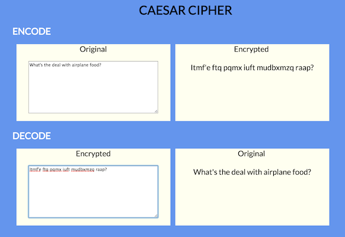
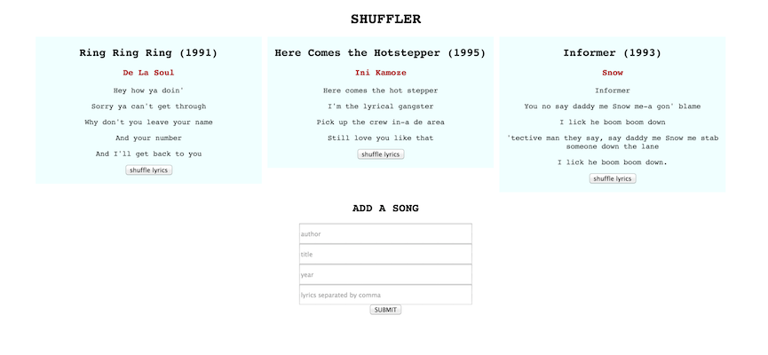

# WDI-PANTHALASSA

---
Title: Cipher & Shuffler <br>
Type: Homework <br>
Duration: "4:00"<br>
Creator:<br>
    Original creator: Thom Page for WDI-Meeseeks <br>
    Modified by: Kristyn Bryan <br>
    Course: WDIr Panthalassa<br>
Competencies: Basic Angular <br>
Prerequisites: Angular, Javascript, HTML, CSS <br>

---

## Part 1

## CAESAR CIPHER

### Angular js basics


## APP

Make a Caesar Cipher page that takes an input and encodes it with a Caesar Cipher and and displays the encoded input while the user is typing. (no submit button).

Also make it so the user can decode an encoded message.





### ANGULAR DIRECTIVES

- `ng-keyup`
- `ng-model`


### CAESAR CIPHER

https://en.wikipedia.org/wiki/Caesar_cipher

You can put this Caesar Cipher code (or the code that you wrote a few weeks ago for the morning exerice) in a separate js file (before your main `app.js`), and then reference the `caesarShift` function in your angular controller.

**Commit 1** <br>
<hr>
"Commit 1: Made an app.js with my Caesar Cipher function."
<hr>

In the example in the above image, the `amount` is set to `12` for encoding, and `-12` for decoding.

```
var caesarShift = function(str, amount) {

	// Wrap the amount
	if (amount < 0)
		return caesarShift(str, amount + 26);

	// Make an output variable
	var output = '';

	// Go through each character
	for (var i = 0; i < str.length; i ++) {

		// Get the character we'll be appending
		var c = str[i];

		// If it's a letter...
		if (c.match(/[a-z]/i)) {

			// Get its code
			var code = str.charCodeAt(i);

			// Uppercase letters
			if ((code >= 65) && (code <= 90))
				c = String.fromCharCode(((code - 65 + amount) % 26) + 65);

			// Lowercase letters
			else if ((code >= 97) && (code <= 122))
				c = String.fromCharCode(((code - 97 + amount) % 26) + 97);

		}

		// Append
		output += c;

	}

	// All done!
	return output;

};
```
**Commit 2** <br>
<hr>
"Commit 2: Connected the cipher to decode messages."
<hr>

**Commit 3** <br>
<hr>
"Commit 3: Connected the cipher to encode messages."
<hr>

Add a little bit of styling to your cipher. Take a screenshot of it and upload it to your folder.

**Commit 4** <br>
<hr>
"Commit 4: Uploaded the screenshot of the cipher."
<hr>

## Part 2

##SONG LYRICS SHUFFLER


You will make a static page that displays songs with the song title, author, year, and lyrics. For no really good reason other than to practise `ng-click` and execute controller functions, you will be able to shuffle the order of the lyrics by clicking a shuffle button, as well as hide/show the song by clicking on the title.

Ultimately, you can add new songs to the page.

Sample screenshot:


#### The app should:
- Display song titles, authors, years, and lyrics line by line
- Hide / show the song by clicking on the title (the title does not get hidden 'cos you still have to click on it to show the song again)
- Shuffle the lyrics by pressing a shuffle button
- Add a new song
	- When entering lyrics, the user should separate the lines of lyrics with a comma. **HINT FOR LATER** when the form is submitted, the app could `split` the lines by comma for use in an array  

#### Set up - you will need:
- `index.html`
- `app.js`
- `style.css` if you want to add some style

#####Sample data

```
this.songs = [ 
  {
	author: "De La Soul",
    title: "Ring Ring Ring",
	lyrics: [
		      "Hey how ya doin'",
	          "Sorry ya can't get through",
			  "Why don't you leave your name",
			  "And your number",
			  "And I'll get back to you"
			],
	year: 1991,
	hidden: false
  }, {
	author: "Ini Kamoze",
	title: "Here Comes the Hotstepper",
	lyrics: [
			  "Here comes the hot stepper",
			  "I'm the lyrical gangster",
			  "Pick up the crew in-a de area",
			  "Still love you like that"
	        ],
	year: 1995,
	hidden: false
   }, {
		author: "Snow",
		title: "Informer",
		lyrics: [
				  "Informer",
				  "You no say daddy me Snow me-a gon' blame",
				  "I lick he boom boom down",
				  "'tective man they say, say daddy me Snow me stab someone down the lane",
			      "I lick he boom boom down."
			    ],
				  year: 1993,
				  hidden: false
   }
];
```

Server and database will be introduced tomorrow
Overall, you will need data and functions in your controller.

**Commit 5** <br>
<hr>
"Commit 5: Set up my initial files."
<hr>


#####Display songs
- A link to Angular 1.5 from https://angularjs.org/
- module / `ng-app`
- controller / `ng-controller`
- `ng-repeat` ( you might want to include a `track by $index` in the directive params, but if you don't need to, then don't)
- `ng-click` (hint: you can pass in $index as a param)
- `ng-if` or alternatively, `ng-hide` and/or `ng-show`
- curlies `{{ }}`

**Commit 6** <br>
<hr>
"Commit 6: Setup and now displaying the songs."
<hr>

#####Add a song
- a form with an `ng-submit`
- inputs that rout to `ng-model`s which could be inside a formdata object in the controller maybe.

**Commit 7** <br>
<hr>
"Commit 7: Setup and now able to add a song."
<hr>

#####Shuffle function
Pass in an array and the shuffle function will randomize the order of the elements

```
	  function shuffle(a) {
	    var j, x, i;
	    for (i = a.length; i; i -= 1) {
	        j = Math.floor(Math.random() * i);
	        x = a[i - 1];
	        a[i - 1] = a[j];
	        a[j] = x;
	    }
    	return a;
	  }
```

**Commit 8** <br>
<hr>
"Commit 8: Can shuffle the order of the songs."
<hr>

Add a little bit of styling to your shuffler. Take a screenshot of it and add it to your folder.

**Commit 9** <br>
<hr>
"Commit 9: Added a screenshot of my shuffler."
<hr>
