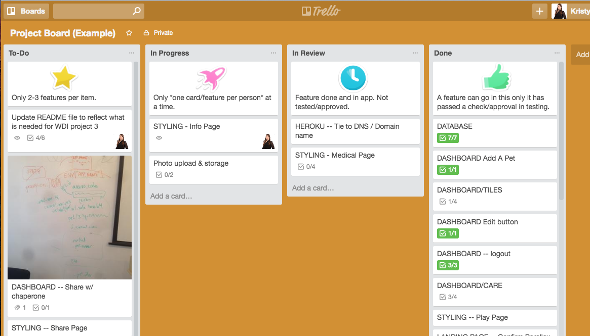

# Morning Exercise

In this morning's exercise, I want to introduce you to some of the product management tools that you will be encountering on the job and also get you familiar with Trello. You will be using Trello to keep track of your 3rd project (and beyond!).

## Agile Development

## Scrum

#### History of Scrum (reference can be found [here](https://en.wikipedia.org/wiki/Scrum_(software_development) )

Scrum was first defined as "a flexible, holistic product development strategy where a development team works as a unit to reach a common goal" as opposed to a "traditional, sequential approach" in 1986 by Hirotaka Takeuchi and Ikujiro Nonaka in the New Product Development Game.[5] Takeuchi and Nonaka later argued in The Knowledge Creating Company[6] that it is a form of "organizational knowledge creation, [...] especially good at bringing about innovation continuously, incrementally and spirally".

The authors described a new approach to commercial product development that would increase speed and flexibility, based on case studies from manufacturing firms in the automotive, photocopier and printer industries.[7] They called this the holistic or rugby approach, as the whole process is performed by one cross-functional team across multiple overlapping phases, where the team "tries to go the distance as a unit, passing the ball back and forth".[7] (In rugby football, a scrum refers to a tight-packed formation of players with their heads down who attempt to gain possession of the ball.[8])

#### Daily Scrum

This might look familiar - we do a version of this during your project week:
Daily scrum[edit]

A daily scrum in the computing room. This centralized location helps the team start on time.
Each day during a sprint, the team holds a daily scrum (or stand-up) with specific guidelines:

All members of the development team come prepared. The daily scrum...

  ...starts precisely on time even if some development team members are missing 
  ...should happen at the same time and place every day 
  ...is limited (timeboxed) to fifteen minutes 
  
Anyone is welcome, though normally only scrum team roles contribute.
During the daily scrum, each team-member answers three questions:
What did I do yesterday that helped the development team meet the sprint goal?
What will I do today to help the development team meet the sprint goal?
Do I see any impediment that prevents me or the development team from meeting the sprint goal?
Any impediment (stumbling block, risk or issue) identified in the daily scrum should be captured by the scrum master and displayed on the team's scrum board, with an agreed person designated to working toward a resolution (outside of the daily scrum). No detailed discussions should happen during the daily scrum.

## Using a tracker in Scrum Development

There are a few different tools that can be used to plan scrum development. We're just going to look at briefly at two of them, but here's a more comprehensive [list](https://en.wikipedia.org/wiki/Comparison_of_Scrum_software) of what might be used and the features that come with them.

### Jira

### Trello

We're doing small applictions and don't need all the fancy stuff that comes with Jira, so we'll use *Trello* to mimic the flow that most of you will be using during production!

Each column is referred to as a "list" and inside the list sit "cards". Each of these cards is meant to contain information to create one feature of your application. Only one person may take ownership of a card AND only one card should be claimed at a time. Depending how you decide to do this with your team, each card may also represent a branch in Github (this is how it works in Jira). 

## Activity

You will be paird up and will need to do the following to set up a Trello board that you can use for a pretend application:

1. Individually, create a Trello account: www.trello.com
2. When making your Trello account, be sure to take note of your screenname OR update the screenname that they automatically assign to you to something that you will remember (and that is at least semi-professional).
2. With your partner, decide who will initially create the Trello board.
3. Create the lists for "To-Do", "In Progress", "In Review", and "Done".
4. With the following user stories, create cards (issues) under "To-Do" that split up the work into pieces that can be individually tackled. You will literally be creating Github issues for these once you complete one before you merge it into your master repo. EXAMPLE: The user should be able to upload a profile picture.
You might break the issues up as follows: "Photo Upload - install Paperclip", "Photo Upload - AWS API integration", or "Photo Upload - research how to do this"
 *USER STORIES*

5. Discuss which cards that you'd like to take and work on for your first stab at the project. It's advisable to select things that won't have you working inside the same file - this way you won't have merge conflicts (so perhaps somene can do some styling while the other person works on some logic). *Add yourself* to the card (`Members`) and move it over to the "In Progress" List.
6. Have you run into any issues? Can you see how this might be advantageous to use when working with other people?
